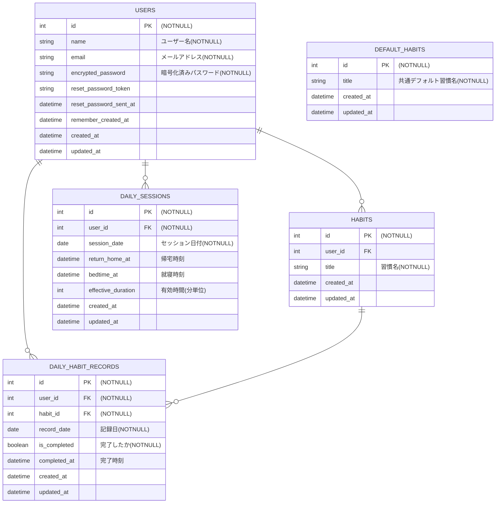

## サービス名

時間作るん

## サービス概要

時間作るんは、誰もが**毎日必ずする習慣**を手助けするサービスです。
**毎日必ずする習慣**（自炊、洗濯、風呂、歯磨き等）が出来たら記録をつけていき、その結果をカレンダーに表示します。
小さな達成を積み重ねて、習慣を自然に身につけていき、日々使える時間を増やすことができます。

## このサービスへの思い・作りたい理由

現在、働きながらプログラミングを学んでいます。
仕事が終わった後に勉強するというのはなかなかハードルが高く、辛いものだと日々感じてます。
私はその辛さの大きな原因として、時間が無いことだと考えてます。
なんとかして自分の使える時間を生み出せないかと悩んでた際、日常生活での無駄を減らせばよいと考えました。
無駄な時間をなくすことができたという達成感を毎日感じることによって、辛さも減っていくと考えています。

### このサービスにおける無駄な時間の定義（例）

1. 風呂に入ろうと決心する（22時）
2. 面倒くさいと思う
3. スマホさわったりテレビみたりしてだらだらする（30分くらい）
4. そろそろ風呂に入ろうと思い、入る（22時30分）
5. 1.〜4.で発生した30分間は無駄な時間！

## ユーザー層について

- 社会人、主婦、学生など該当は幅広く想定しています。  
私自身と照らし合わせ、特に働いた後の社会人に使っていただきたいです。
- やるべきことがあるのに、気づいたら時間が経っていると日々後悔している方が対象です。
- やるべきことの有無に関わらず、時間を効率よく使いたい方が対象です。

## サービス利用のイメージ（例：帰宅後のサラリーマン）

1. ユーザー登録をします。
2. 習慣一覧画面へ移動します。
3. 初期設定で**毎日必ずする習慣**（洗濯、風呂、歯磨き）が登録されています。追加で自分の嫌な習慣も登録可能です。
4. 働いて家に帰宅したら、習慣一覧画面にある「帰宅」ボタンを押します。
5. 「帰宅」ボタンを押すと、日々の習慣（毎日必ずする習慣、自分が登録した習慣）が押せるようになります。
6. 押すと、その習慣の詳細が出てきて、「（その習慣を）やった」ボタンがあるので、やったら押します。
7. 登録したすべての習慣の「やった」ボタンを押します。
8. すべての習慣の「やった」ボタンを押すと、「就寝」ボタンが押せるようになるので、就寝するときに押します。
9. 7.で押された習慣のうち、最も遅く「やった」ボタンが押された時刻と、8.で押された時刻の差分は有効に使える時間だと考えてます。
10. **無駄な時間を減らせたことにより生まれた有効に使える時間を、カレンダーで見ることができます。**

## ユーザーの獲得について

- インターネットやXを利用した拡散  
ちょっとした無駄な時間を減らせたと拡散されれば利用したいと考える人も増えていく想定です。

## サービスの差別化ポイント・推しポイント

1. 差別化ポイント  
習慣化サービスが多くありますが、本サービスでは**毎日必ずする習慣**に重きをおいて習慣化します。
本サービスは、ユーザー登録時、自動的に毎日必ずする習慣（洗濯、風呂、歯磨き）が登録されます。（不要であれば削除可能です。）

| 特徴 | 時間作るん（本サービス） | 競合Aサービス | 競合Bサービス |
| - | - | - | - |
| 想定している習慣 | 自炊、洗濯、風呂、歯磨き | 読書、筋トレ、散歩 | 読書、筋トレ、散歩 |
| 想定しているユーザー層 | ◎ 意識の低い層 特に忙しい社会人・主婦・学生 | △ 意識の高い層 | △ 意識の高い層 | 
| 実施のハードル | ◎ 日々必須でやるべきこと | ⚪︎ わざわざ時間を作る必要がある （習慣はあえて1つだけ設定） | △ わざわざ時間を作る必要がある （習慣を複数設定） |
| 習慣達成の実感 | ◎ 無駄な時間を減らせた達成感がある | △ 項目を1つに絞っており 人によっては感じづらい | △ 達成後に満足して 時間を無駄にしてしまう可能性がある |

2. 推しポイント  
本サービスを利用することで、気づかないうちに無駄になっている時間を取り戻すことができます。

3. 継続利用のために  
本サービスはデフォルトの習慣（洗濯、風呂、歯磨き）を設定して、わざわざ習慣を登録しなくてもよいようにします。 
ログイン完了後すぐに項目を表示し、ボタンワンクリックで習慣を入力し終わります。 
日々の習慣が完了するとカレンダーに色がつき、まるでパズルが埋まっていくような感覚になります。（仮）

## 機能候補

### 【MVPリリース時点での機能】

- ユーザー登録・編集機能（メールアドレス）
- ログイン・ログアウト機能（メールアドレス）
- 日々の習慣作成機能
- 日々の習慣登録機能
- 日々の習慣削除機能
- 日々の習慣編集機能
- カレンダーに有効に使えた時間を表示する機能

### 【本リリース実装予定の機能】

- パスワードリセット機能
- ユーザー登録機能（LINE・google）
- ログイン機能（LINE・google）
- LIFF機能
- PWA対応（まるでスマートフォンのアプリのように使えるようにする技術）
- 前日に達成した習慣を指定した時間に、通知させる機能（LINE）
- カレンダーパズル機能
#### 検討中
- i18nによる日本語化対応

## 機能の実装方針

| 機能 / カテゴリ | 技術 |
| - | - |
| バックエンド | Ruby on Rails 7.2.2.1 / Ruby 3.2.3 |
| フロントエンド | JavaScript / Stimulus |
| CSS フレームワーク | Tailwind CSS |
| 環境構築 | Docker |
| インフラ | Render |
| データベース | PostgreSQL |
| 認証機能 | Devise / omniauth-line / omniauth-google-oauth2 |

## 画面遷移図

https://www.figma.com/design/AB77xgxg39nGXgD8SHgSEi/%E6%99%82%E9%96%93%E4%BD%9C%E3%82%8B%E3%82%93?node-id=20-2&p=f&t=4CYouGWBatNeBuBA-0

## ER図

